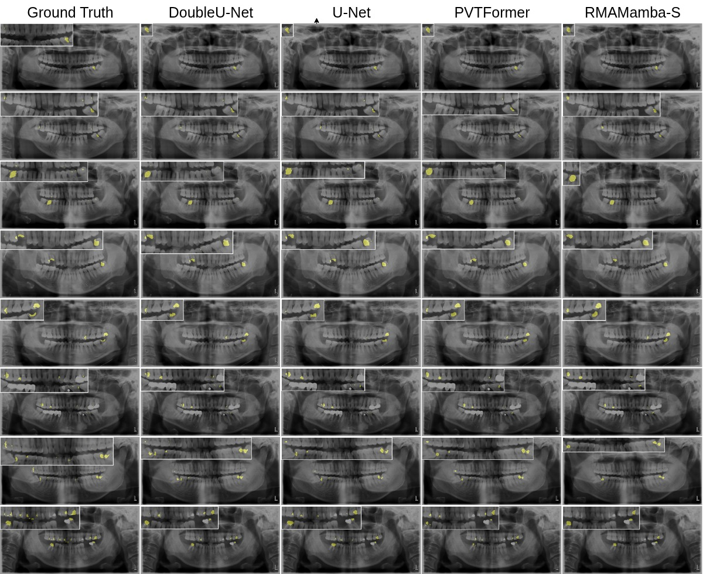

# When CNNs Outperform Transformers and Mambas: Revisiting Deep Architectures for Dental Caries Segmentation

## Overview
This repository contains the source code for When CNNs Outperform Transformers and Mambas: Revisiting Deep Architectures for Dental Caries Segmentation

## Qualitative results
<p align="center">
 
  <em> Figure 3: Qualitative Examples of Dental Caries Segmentation on the DC1000 Dataset</em>
  </p>


## Create Environment
```
conda create -n caries-seg python==3.9.0
conda activate caries-seg
```

## Install Dependencies
```    
pip install -r requirements.txt
cd selective_scan && pip install .
```

## Download Dataset
Download DC1000 dataset from [Google Drive](https://drive.google.com/file/d/1UABfWMw7Vvd2KC1xyAOlAS3OXNKPtMED/view?usp=drive_link).
Move it to the `data` directory.

## Train
```
python train.py 
```

## Test
```
python test.py
```

## Citation
Please cite our paper if you find the work useful:
```
@article{ghimire2025caries,
  title={When CNNs Outperform Transformers and Mambas: Revisiting Deep Architectures for Dental Caries Segmentation},
  author={Ghimire, Aashish and Zeng, Jun and Paudel, Roshan and Tomar, Nikhil Kumar and Nayak, Deepak Ranjan and Nalla, Harshith Reddy and Jha, Vivek and Reynolds, Glenda and Jha, Debesh},
  journal={arXiv preprint arXiv:2511.14860},
  year={2025}
}
```

## Contact

Please contact zeng.cqupt@gmail.com for any further questions.
